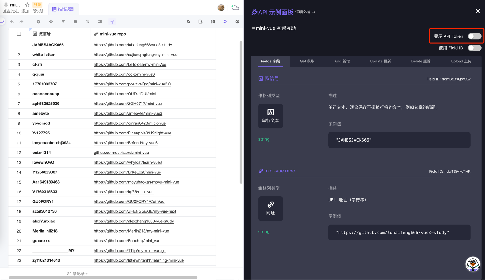

# @cxs/auto-star

## 说明
用于催~~卷~~学社自动star项目，项目地址维护在[这里](https://vika.cn/workbench/dst4inQ7sWdyUT3Xi9/viwWt7BNc5Hw3)~

## 使用方式
1. fork一份代码
2. 去github账号下的 `Settings / Developer settings` 中生成一个token
3. 将token配置到fork的项目中 `Settings / Secrets` 中， 并取名为 `TOKEN`
4. `Settings / Secrets` 中新增 `VIKA_TOKEN`。token的获取方式如下图所示。点击下图中的按钮，会提示你绑定邮箱并新增vikaToken。**注意：邮件可能会被放到垃圾邮箱中，留意下~**
5. 
6. 自动star的操作于每日上午9点自动执行，如果想要改变时间，可以去 `.github/workflows/main.yml` 中修改 `cron` 配置。时间为 `UTC时间`，所以设置时需要 `减去8小时`

